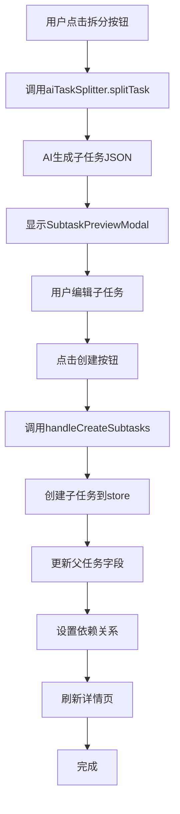

# AI任务拆分功能

**版本**: v1.7.7  
**状态**: ✅ 已实现  
**负责人**: 开发团队  
**实现日期**: 2026-02-27  
**最后更新**: 2026-02-27

---

## 📋 目录
- [功能概述](#功能概述)
- [使用方法](#使用方法)
- [技术实现](#技术实现)
- [数据流程](#数据流程)
- [Bug修复记录](#bug修复记录)
- [测试用例](#测试用例)

---

## 功能概述

AI任务拆分功能允许用户将一个大任务智能拆分为多个可执行的子任务，通过AI自动分析任务标题和描述，生成合理的子任务列表，并自动设置依赖关系。

### 核心特性

1. **智能任务拆解**
   - 输入任务标题和描述
   - AI自动分析并拆分为2-5个子任务
   - 每个子任务包含标题、描述、优先级、预估时长

2. **子任务预览**
   - Bottom Sheet从底部滑出展示拆分结果
   - 支持编辑子任务标题和描述
   - 支持删除不需要的子任务
   - 支持调整优先级和预估时长

3. **依赖关系自动设置**
   - 子任务自动依赖父任务
   - 完成父任务后，子任务才能开始
   - 父任务显示🔓被依赖状态
   - 子任务显示🔒等待中状态

4. **4种拆分模板**
   - **快速拆分**：2个子任务，快速完成
   - **详细拆分**：5个子任务，详细规划
   - **时间优先**：按时间顺序拆分
   - **优先级优先**：按优先级拆分

5. **预估时长**
   - AI为每个子任务估算时长（0.5-8小时）
   - 自动转换为分钟显示
   - 支持手动调整

---

## 使用方法

### 方式1：从任务详情页拆分

1. 打开任务详情页
2. 点击"🔨 AI拆解任务"按钮
3. AI自动分析任务并生成子任务
4. 在预览弹窗中编辑子任务
5. 点击"✅ 创建全部子任务"完成

### 方式2：从任务卡片拆分

1. 在任务列表中找到要拆分的任务
2. 点击任务卡片上的"🔨"按钮
3. 后续步骤同方式1

### 方式3：创建新任务并拆分

1. 点击"🤖"按钮（AI任务拆分入口）
2. 输入任务标题和描述
3. AI自动拆分并创建父任务和子任务

---

## 技术实现

### 核心组件

1. **SubtaskPreviewModal.vue**
   - 子任务预览弹窗
   - Bottom Sheet布局
   - 支持编辑和删除子任务

2. **aiTaskSplitter.js**
   - AI任务拆分服务
   - 调用AI模型生成子任务
   - 返回JSON格式的子任务列表

3. **TodoView.vue**
   - 主任务管理页面
   - 包含创建子任务的逻辑
   - 处理依赖关系设置

### 数据结构

#### 父任务扩展字段

```javascript
{
  hasSplitted: Boolean,      // 是否已拆分
  subtaskCount: Number,      // 子任务数量
  subtasks: Array<Number>    // 子任务ID列表
}
```

#### 子任务字段

```javascript
{
  id: Number,                // 任务ID
  text: String,              // 任务标题
  description: String,       // 任务描述
  priority: String,          // 优先级（high/medium/low）
  estimatedHours: Number,    // 预估时长（小时）
  parentTaskId: Number,      // 父任务ID
  waitFor: Array<Number>     // 依赖的任务ID列表（包含父任务ID）
}
```

#### AI返回格式

```json
[
  {
    "title": "子任务标题",
    "description": "子任务描述",
    "priority": "high",
    "estimatedHours": 1.5
  }
]
```

---

## 数据流程

### 拆分流程



### 依赖关系设置

```javascript
// 子任务等待父任务
subtask.waitFor = [parentTask.id]

// 父任务记录子任务
parentTask.subtasks = [subtask1.id, subtask2.id, ...]
parentTask.hasSplitted = true
parentTask.subtaskCount = subtasks.length
```

---

## Bug修复记录

### 2026-02-27 修复记录

#### Bug 1: 子任务标题显示空白
**问题**: 输入框绑定的是 `subtask.text`，但AI返回的字段是 `title`  
**修复**: 将 `v-model="subtask.text"` 改为 `v-model="subtask.title"`  
**文件**: `src/components/SubtaskPreviewModal.vue`

#### Bug 2: 预计时长显示空白
**问题**: 输入框绑定的是 `subtask.estimatedMinutes`，但AI返回的是 `estimatedHours`  
**修复**: 在watch中转换 `estimatedHours * 60` 为 `estimatedMinutes`  
**文件**: `src/components/SubtaskPreviewModal.vue`

#### Bug 3: 依赖关系反了
**问题**: 父任务等待子任务，逻辑错误  
**修复**: 改为子任务等待父任务（`subtask.waitFor = [parentTask.id]`）  
**文件**: `src/views/TodoView.vue`

#### Bug 4: 父任务subtasks数组未更新
**问题**: 创建子任务后，父任务的subtasks数组为空  
**修复**: 在创建子任务时收集ID并更新父任务  
**文件**: `src/views/TodoView.vue`

#### Bug 5: 新任务拆分时父任务未创建
**问题**: `openTaskSplitterForNew` 创建的是临时对象，没有保存到数据库  
**修复**: 先创建并保存父任务，再打开拆分弹窗  
**文件**: `src/views/TodoView.vue`

#### Bug 6: Bottom Sheet未贴底显示
**问题**: 使用flex布局导致弹窗悬浮在半空中  
**修复**: 改用 `position: fixed` + `bottom: 0` 确保贴底  
**文件**: `src/components/SubtaskPreviewModal.vue`

---

## 测试用例

### 测试用例1: 基本拆分流程

**前置条件**: 已登录，有一个待办任务

**测试步骤**:
1. 打开任务详情页
2. 点击"🔨 AI拆解任务"按钮
3. 等待AI生成子任务
4. 检查子任务预览弹窗是否显示
5. 检查子任务标题、描述、优先级、预估时长是否正确
6. 点击"✅ 创建全部子任务"
7. 检查子任务是否创建成功
8. 检查父任务是否显示🔓被依赖状态
9. 检查子任务是否显示🔒等待中状态

**预期结果**: 所有步骤正常，子任务创建成功，依赖关系正确

### 测试用例2: 编辑子任务

**前置条件**: 已生成子任务预览

**测试步骤**:
1. 修改第一个子任务的标题
2. 修改第二个子任务的描述
3. 修改第三个子任务的优先级
4. 修改第四个子任务的预估时长
5. 点击"✅ 创建全部子任务"
6. 检查创建的子任务是否包含修改后的内容

**预期结果**: 修改生效，创建的子任务包含修改后的内容

### 测试用例3: 删除子任务

**前置条件**: 已生成5个子任务预览

**测试步骤**:
1. 点击第3个子任务的"🗑️"按钮
2. 检查子任务数量是否变为4
3. 点击"✅ 创建全部子任务"
4. 检查是否只创建了4个子任务

**预期结果**: 删除成功，只创建4个子任务

### 测试用例4: 依赖关系验证

**前置条件**: 已创建父任务和子任务

**测试步骤**:
1. 打开父任务详情页
2. 检查是否显示"🔓 被依赖 - 有N个任务等待此任务完成"
3. 打开子任务详情页
4. 检查是否显示"🔒 等待中 - 正在等待[父任务名称]完成"
5. 完成父任务
6. 检查子任务是否收到通知
7. 检查子任务状态是否变为"✅ 无依赖"

**预期结果**: 依赖关系正确，通知正常

### 测试用例5: Bottom Sheet布局

**前置条件**: 已生成子任务预览

**测试步骤**:
1. 检查弹窗是否从底部滑出
2. 检查弹窗是否完全贴着屏幕底部
3. 检查是否有底部空白区域
4. 检查滑出动画是否流畅

**预期结果**: 弹窗完全贴底，无空白区域，动画流畅

### 测试用例6: 新任务拆分

**前置条件**: 已登录

**测试步骤**:
1. 点击"🤖"按钮
2. 输入任务标题"学习Vue3新特性"
3. 输入任务描述"深入学习Composition API、Teleport、Suspense"
4. 等待AI生成子任务
5. 点击"✅ 创建全部子任务"
6. 检查父任务是否创建成功
7. 检查子任务是否创建成功
8. 检查依赖关系是否正确

**预期结果**: 父任务和子任务都创建成功，依赖关系正确

---

## 已知问题

### 技术债务

1. **两个创建子任务的函数**
   - `createSubtasks` (TodoView.vue 第3952行)
   - `handleCreateSubtasks` (TodoView.vue 第4148行)
   - 建议: 统一为一个函数

2. **依赖关系设置逻辑重复**
   - 两个函数中都有依赖关系设置代码
   - 建议: 提取为独立方法

### 未来优化

1. **支持更多拆分模板**
   - 按难度拆分
   - 按技能拆分
   - 按资源拆分

2. **支持自定义拆分数量**
   - 当前固定2-5个子任务
   - 建议: 允许用户指定数量

3. **支持批量拆分**
   - 一次拆分多个任务
   - 提高效率

---

## 相关文档

- [任务依赖关系功能](./TASK_DEPENDENCY_FEATURE.md)
- [AI主动式助手功能](./AI_PROACTIVE_ASSISTANT_FEATURE.md)
- [任务执行日志功能](./TASK_LOG_PHASE1.md)

---

**文档维护**: 开发团队  
**最后更新**: 2026-02-27
